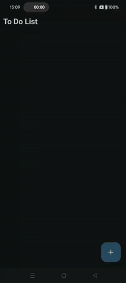

# ToDoList Android App

## Description

This is a simple to-do list Android application built using Java. It allows users to manage their tasks efficiently by adding, updating, and deleting to-do items.

## Screenshots

| Screenshot 1 | Screenshot 2 | Screenshot 3 | Screenshot 4 | Screenshot 5 |
|---------------|---------------|---------------|---------------|---------------|
|  |  |  |  |  |

## Features

- Add new to-do items with title and description.
- Update existing to-do items.
- Delete completed or unwanted to-do items.

## How to Use

1. Clone the repository to your local machine.
2. Open the project in Android Studio.
3. Build and run the project on an Android device or emulator.

## Technologies Used

- Java
- Android SDK

## Credits

- This project was created by Akshar Kalathiya.

## License

This project is licensed under the MIT License - see the [LICENSE.md](../LICENSE) file for details.
