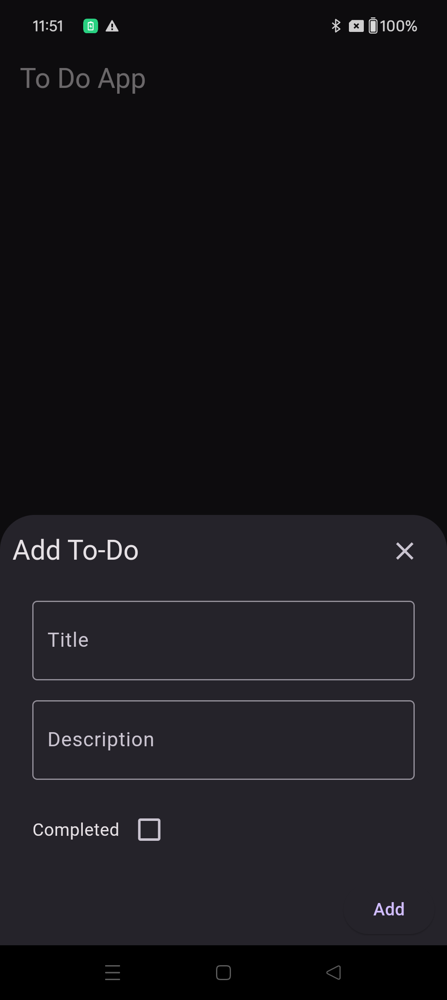

# Flutter ToDoList App

## Description

This is a simple to-do list mobile application built using Flutter. It allows users to manage their tasks efficiently by adding, updating, and deleting to-do items.

## Screenshots

| Screenshot 1 | Screenshot 2 | Screenshot 3 | Screenshot 4 |
|--------------|--------------|--------------|--------------|
|  |  |  |  |

## Features

- Add new to-do items with title and description.
- Update existing to-do items.
- Delete completed or unwanted to-do items.

## How to Use

1. Clone the repository to your local machine.
2. Open the project in your preferred Flutter IDE.
3. Build and run the project on an Android or iOS device/emulator.

## Technologies Used

- Flutter
- Dart

## Credits

- This project was created by [Your Name].
- Special thanks to [Any contributors or resources you want to credit].

## License

This project is licensed under the MIT License - see the [LICENSE.md](../LICENSE.md) file for details.
