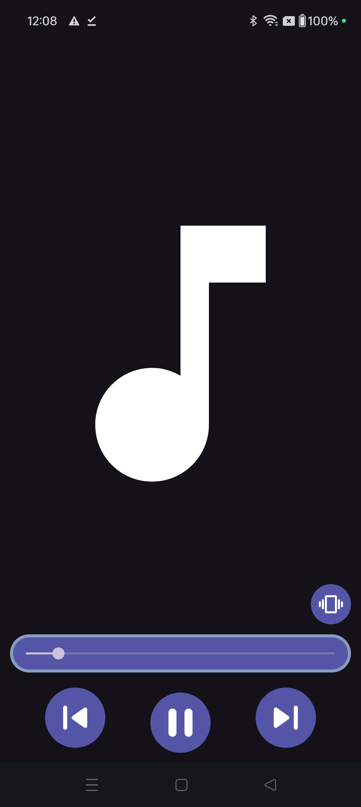
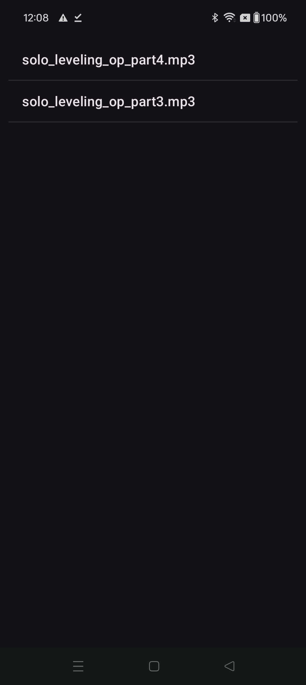

# Basic Music Player App

## Description

The Basic Music Player App is a straightforward application for playing your music tracks. Developed in Java, this app provides essential playback controls and a simple user interface for easy navigation and enjoyment of your music collection.

## Key Features

- **Playback Controls:** Play, pause, skip to the next or previous track.
- **Music Library:** View a list of all music tracks available in the app.
- **Simple Interface:** Easy-to-use interface with intuitive controls for seamless playback.
- **Background Playback:** Continue listening to music while using other apps or when the screen is off.

## Screenshots

## How to Use

1. Clone the repository to your local machine.
2. Open the project in your preferred Java IDE.
3. Build and run the project on an Android device or emulator.
4. Explore the music library and select a track to play.
5. Use the playback controls to control the music (play, pause, next, previous).

## Technologies Used

- Java
- Android SDK

## Credits

- This project was created by [Your Name].
- Special thanks to [Any contributors or resources you want to credit].

## License

This project is licensed under the MIT License. See the [LICENSE](../LICENSE) file for details.
